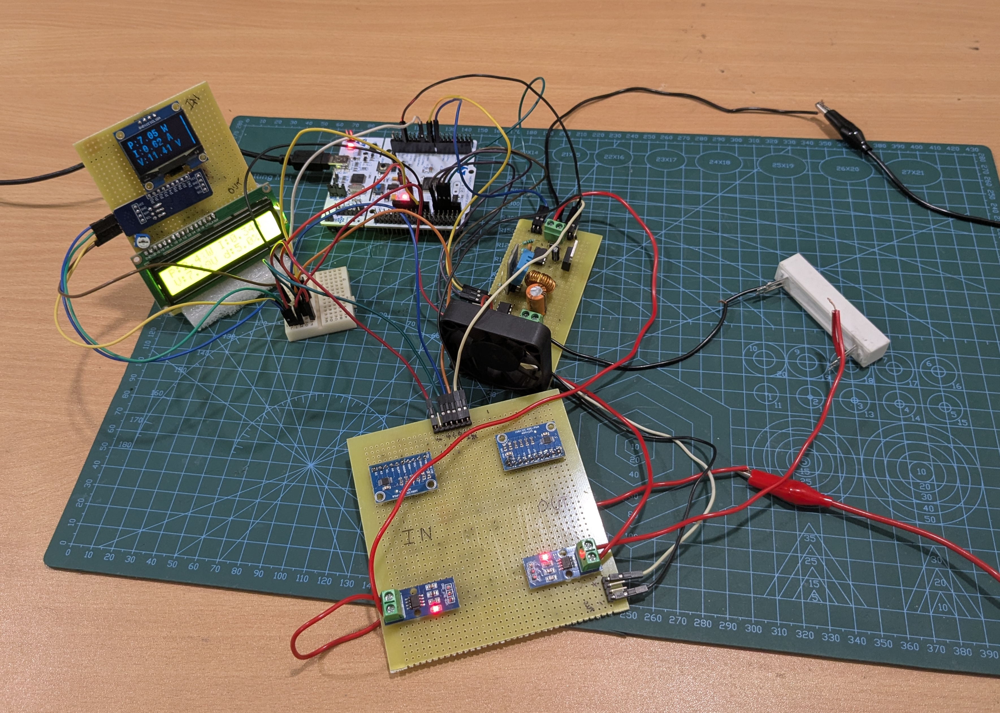
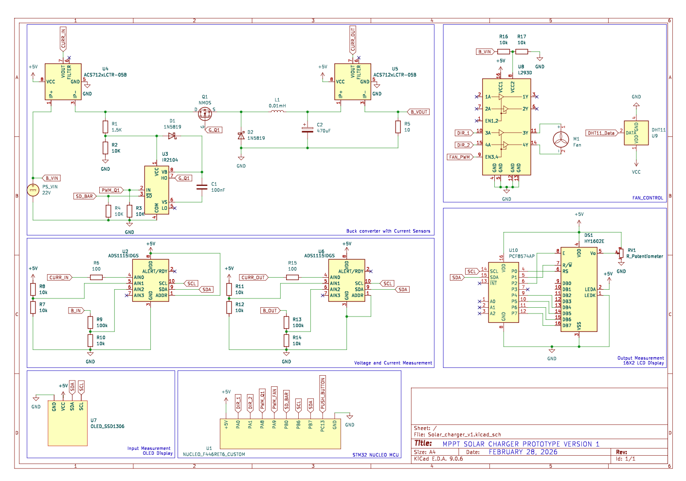

# Virtual Inertia Control Algorithm (VICA)

The why: When IBRs will increase, the inertia in the power grid will decrease. The [POSOCO-IITB REPORT](docs/15_VI_posoco.pdf) mentions that the inertia is already decreasing. When IBRs will dominate, power blackouts shall be more frequent. So, it is good to start experimenting *virtual inertia* based control algorithms that emulate a synchronous generator and decoupled with a BSS. 

This repository is a hobby project to develop an industrial-grade and fully-implemented Virtual Inertia Control Algorithm (VICA) using ARM-Cortex M4 microcontroller unit. This project requires a mix of power electronics, embedded firmware and control systems. Present roadmap of this project is as follows: 

## Roadmap 
### 1. MPPT Solar-Battery Charger
        V1. Custom designed Buck converter with duty cycle controlled by user-button (B1) on Nucleo-board. 
        V2. Add MPPT Control algorithm to A. 
        V3. Replace Buck converter with a Flyback or interleaved Buck-Boost converter. 

### 2. MPPT Solar-Inverter 
        V4. Design an industrial H-bridge topology inverter. 
        V5. Add MPPT Control with Clarke and Park transformation (DQ-Axis theory). 

### 3. Implement VICA 
        V6. Design, test and implement VICA on the inverter. 

## Current Status 
Currently, a custom non-synchronous buck converter is build with fan-controlled cooling. The topology and image can be seen in `/docs` folder. 

